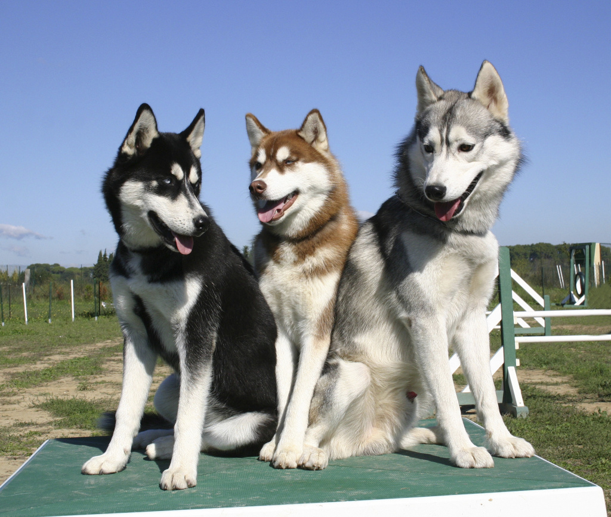
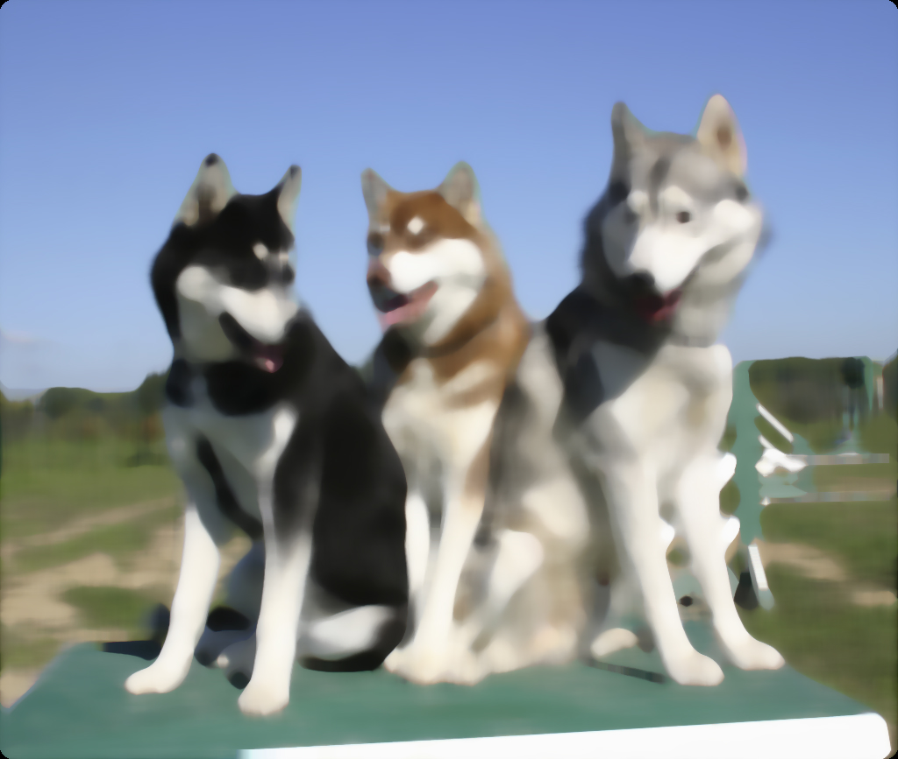
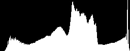

# CUDA GPU filters

1. Размытие картинки и "Median filter"
Возьмите произвольную картинку (цветную или черно-белую).
а) Фильтр по шаблону. В каждом пикселе картинки надо усреднить по шаблону с коэффициентами в окрестности данного пикселя. Например, для шаблона 5x5:
```c++
for(int k=-2;k<=2; k++)
{
    for(int l=-2; l<=2; l++)
    {
        u[i][j]+=1/s*a[k][l]*u[i+k][j+l];
    }
}
```
// s = сумма всех коэффициентов шаблона (25 значений для 5x5)
Продемонстрируйте результат размытия для 2 разных шаблонов.

б) Median filter (15 баллов)
Имплементируйте https://en.wikipedia.org/wiki/Median_filter на CUDA

2. Гистограмма картинки
Загрузите или создайте картинку (если она цветная можете конвертировать в grayscale или сделать гистограмму для каждого канала), сделайте гистограмму по яркости. (30 баллов)1. Размытие картинки и "Median filter"
Возьмите произвольную картинку (цветную или черно-белую).
а) Фильтр по шаблону. В каждом пикселе картинки надо усреднить по шаблону с коэффициентами в окрестности данного пикселя. Например, для шаблона 5x5:
```c++
for(int k=-2;k<=2; k++)
{
    for(int l=-2; l<=2; l++)
    {
        u[i][j]+=1/s*a[k][l]*u[i+k][j+l];
    }
}
```
// s = сумма всех коэффициентов шаблона (25 значений для 5x5)
Продемонстрируйте результат размытия для 2 разных шаблонов.

б) Median filter (15 баллов)
Имплементируйте https://en.wikipedia.org/wiki/Median_filter на CUDA

2. Гистограмма картинки
Загрузите или создайте картинку (если она цветная можете конвертировать в grayscale или сделать гистограмму для каждого канала), сделайте гистограмму по яркости. (30 баллов)

Filter Type              |  Original          |      Filtered
------------------------:|:------------------:|:-------------------------:
**Median Filter** on 4k  ||  
**Median Filter**        |    |  
**hist**                 | |

## Souces

* **filter.cu** - CUDA template filter 
* **histogram.cu** - CUDA image histogram
* **median_filter.cu** - CUDA median filter
