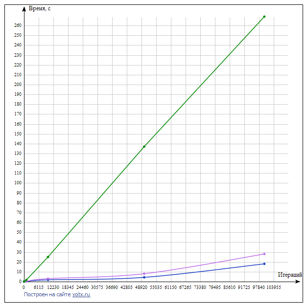

# Rule 110 (not only) cellular automata

Знакомство в компании
Представим, что процессы – это компания незнакомых людей, которые знакомятся с помощью следующей игры:
1) Начинает процессор 0. Случайным образом он выбирает другой процессор i и посылает ему сообщение со своим именем (можете случайным образом задавать имя)
2) Процессор i отсылает сообщение случайному процессору j (которые еще не участвовал в игре), в сообщении – все имена и ранги предыдущих процессоров в правильном порядке. Номер процессора j знает только I, так что все должны быть начеку.
3) Игра заканчивается через N ходов. Используйте синхронную пересылку MPI_SSend
Напишите программу используя MPI.
Параллельный одномерный клеточный автомат.
С помощью MPI распараллельте одномерный клеточный автомат Вольфрама (Rule110).
Игра происходит следующим образом:
1) Инициализируйте одномерный массив 0 и 1 случайным образом
2) В зависимости от значений: левого соседа, себя, правого соседа на следующем шаге клетка либо меняет значение, либо остается той же. Посмотрите, например, что значит Rule110 (https://en.wikipedia.org/wiki/Rule_110)
Сделайте периодические и непериодические граничные условия
Работает параллельный код на нескольких процессах
Имплементированы клетки-призраки (ghost cells)
Можно поменять правило игры (сделать одно из 256)
График ускорения работы программы от кол-ва процессов
Картинка эволюции для одного правила

* Параллельная игра «Жизнь» (*)
Распараллельте игру «Жизнь» Конвея (https://en.wikipedia.org/wiki/Conway%27s_Game_of_Life)
* Война и Мир (*)
С помощью работы на нескольких процессах (MPI) найдите топ-10 встречающихся слов в романе «Война и Мир» Л.Н. Толстого

## Sources

* **rule101_mpi.c** - 101(Any) Rule cellural automata MPI implementation
* **rule101_seq.c** - 101(Any) Rle cellural automata implementation
